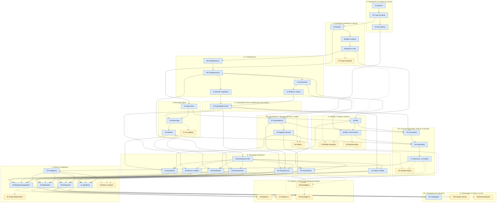

# Curso: Mineralogia — da cristalografia à gênese (base e avançado)

**Estado:** in_progress
**Criado em:** 2026-09-29T00:00:00-03:00  ·  **Atualizado em:** 2026-10-06T18:30:00-03:00
**Base do currículo:** pesquisa das ementas e sumários de referência, cruzada com o escopo previsto pelo usuário: ementas do IGc-USP — GMG0106 Cristalografia Fundamental (45 h) e GMG0220 Mineralogia (105 h), com as optativas GMG0203 Mineralogia Aplicada e GMG0425 Técnicas Gemológicas (pasta GradeCurricular/Geologia-USP) —; sumários de Klein & Dutrow, Manual of Mineral Science, 23a ed. (22 capítulos, incl. crescimento e defeitos, estabilidade e diagramas de fase, processos pós-cristalização, gemas e assembleias); Nesse, Introduction to Mineralogy (cristalografia, cristaloquímica, estrutura, crescimento mineral, óptica, DRX, análise química, sistemática por classe estrutural); Putnis, An Introduction to Mineral Sciences (simetria, anisotropia, difração, espectroscopia, defeitos, energética, soluções sólidas, exsolução, ordem, cinética, transformações); Perkins, Mineralogy (gênese por ambiente ígneo, sedimentar, metamórfico e de minério); Wenk & Bulakh, Minerals: Their Constitution and Origin (formação e ambientes); Dyar & Gunter, Mineralogy and Optical Mineralogy (MSA); Deer, Howie & Zussman (minerais formadores de rocha); Nesse, Introduction to Optical Mineralogy; normativo IMA-CNMNC (definição de mineral, lista de espécies, nomenclatura de grupos) e classificação Nickel-Strunz/Dana; Mindat e RRUFF como referência de dados.
**Partida:** ensino médio completo, sem geologia prévia. Curso autossuficiente: nenhum pré-requisito cruzado para outros cursos; a química, a óptica e o contexto geológico necessários são reconstruídos dentro do próprio curso (módulos 01, 03 e 14).  ·  **Chegada:** avançado — nível de graduação plena em mineralogia e cristalografia, com incursões de pós-graduação nos módulos de aprofundamento (grupos espaciais, difração avançada, cinética, inclusões fluidas, geotermobarometria, mineralogia gemológica).
**Volume estimado:** 50 módulos · ~262 aulas de ≤30 min · ~109-131 h (núcleo: 199 aulas, 83-100 h; aprofundamento: 63 aulas, 26-32 h) de estudo

## Ao final do curso você vai conseguir

- Descrever a simetria, as formas e a geometria de um cristal com a notação cristalográfica formal (grupos pontuais, índices de Miller, projeção estereográfica, retículos de Bravais) e ler um grupo espacial.
- Explicar a estrutura e a composição de um mineral pela cristaloquímica (raios iônicos, coordenação, regras de Pauling, substituição e solução sólida) e calcular sua fórmula estrutural a partir de uma análise química.
- Identificar minerais por propriedades físicas, ao microscópio petrográfico (luz plana, polarizadores cruzados e conoscopia) e por difração de raios X, declarando o grau de confiança.
- Selecionar e interpretar os métodos analíticos adequados a um problema mineralógico (MEV, microssonda, Raman, FTIR, LA-ICP-MS, EBSD, inclusões fluidas).
- Ler diagramas de fase e aplicar a termodinâmica e a cinética para prever estabilidade, cristalização, exsolução e transformações minerais.
- Interpretar crescimento, zoneamento, sobrecrescimento, intercrescimento, dissolução, pseudomorfose e inclusões como registro da história de um cristal, separando observação, descrição interpretativa, interpretação genética e hipótese de processo.
- Descrever os principais minerais de cada classe química pela sistemática IMA/Nickel-Strunz, nomeá-los pelas regras da IMA e relacioná-los a seus ambientes de formação e paragêneses.
- Reconstruir a gênese e a sequência paragenética de uma assembleia mineral em ambiente magmático, pegmatítico, hidrotermal, metamórfico, sedimentar ou supergênico.
- Descrever e catalogar um espécime de coleção com os campos cristalográficos, texturais, de superfície, de associação e de propriedades, com grau de confiança explícito.

> Este arquivo é gerado a partir de `course-state.yaml`. Edições feitas aqui fora
> da seção de notas são sobrescritas na próxima geração.

## Estado

- **Módulos:** 11 de 50 concluídos
- **Aulas escritas:** 62
- **Questionários:** 21
- **Flashcards:** 811 Basic · 199 Cloze
- **Módulo atual:** 13
- **Próximo passo:** Módulos 01 a 06 e 08 a 12 concluídos (07, grupos espaciais, é aprofundamento e fica para a segunda passagem). Módulo 10 fechado em 2026-10-06: 5 aulas (aula 05 e objetivo oa05 acrescentados com IDs novos); auditoria 🟠 3, 🟡 6, 🔵 1 corrigidos; revisão 🟠 1, 🟡 3 corrigidos, 🔵 3 abertos; questionário final (15 q, 37 pts); baralho 70 Basic + 8 Cloze; 3 figuras SVG. Módulo 11 fechado em 2026-10-06: 5 aulas; auditoria 🟡 3 corrigidos, nenhum aberto (todas as razões Si:O e cargas recalculadas em Python); revisão 🟡 5 corrigidos, 🔵 3 abertos; questionário final (15 q, 37 pts); baralho 57 Basic + 8 Cloze; 3 figuras SVG. Módulo 12 (defeitos cristalinos e maclas) fechado em 2026-10-06: 7 aulas (a aula 02 do planejamento foi dividida na revisão didática: Parte 1 manteve o ID a02, Parte 2 recebeu o ID novo a07; arquivos renumerados 03-06 → 04-07); 3 figuras SVG; auditoria em três passagens (🔴 1, 🟠 17, ⚪ 1 corrigidos, nenhum aberto; a terceira, sobre questionários e baralho, corrigiu 🟠 5, entre eles a Q22 do final e a generalização de que discordâncias parciais margeiam um defeito planar, em geral falha de empilhamento, nas aulas 02 e 03; contas dos gabaritos refeitas em Python); revisão didática 🟠 3, 🟡 11 corrigidos, 🔵 3 abertos; questionários parcial 1 (9 q, 18 pts), parcial 2 (10 q, 19 pts) e final (15 q, 41 pts); baralho 111 Basic + 9 Cloze. Pendências não bloqueantes herdadas: m09 (🔵 óxidos da olivina de San Carlos a conferir em Jarosewich et al. 1980), m01 (cloze com mais de 3 lacunas, quase-duplicatas), m02 (auditoria cross-course com curso-geologia m04 a03); o módulo 36 deve conferir o parâmetro c do ortoclásio na fonte primária; o módulo 22 deve decidir, com fonte, qual polimorfo de Al2SiO5 é estável a 25 °C e 1 atm (evitado no m10); o módulo 34 deve conferir o β da tremolita no Handbook of Mineralogy (m11 usou 104,8–104,95°). Próximo passo: Módulo 13 (propriedades físicas e identificação macroscópica), começando pelas aulas.

## Módulos

Os 50 módulos aparecem como subpáginas abaixo, na ordem do currículo. Apenas os Módulos 01, 02, 03, 04, 05, 06, 08, 09, 10, 11, 12 têm conteúdo completo (aulas, auditoria, questionário, flashcards e roteiros de voz); os demais têm o hub com objetivos e pré-requisitos definidos, aguardando geração.

### I. Fundamentos: da matéria ao mineral

- ✅ **01 — Fundamentos químicos: átomo, tabela periódica e ligação** · 6/6 aulas · questionário + 134 cards · auditado — [[01-fundamentos-quimicos/01-fundamentos-quimicos-modulo|abrir]]
- ✅ **02 — O que é um mineral: definição, espécie e classificação** · 5/5 aulas · questionário + 77 cards · auditado · pré-req: 01 — [[02-o-que-e-mineral/02-o-que-e-mineral-modulo|abrir]]
- ✅ **03 — A Terra como fábrica de minerais: contexto geológico mínimo** · 4/4 aulas · questionário + 78 cards · auditado · pré-req: 01, 02 — [[03-terra-fabrica-de-minerais/03-terra-fabrica-de-minerais-modulo|abrir]]

### II. Cristalografia geométrica e reticular

- ✅ **04 — Simetria e morfologia cristalina: operações, classes e sistemas** · 7/7 aulas · questionário + 106 cards · auditado · pré-req: 02 — [[04-simetria-e-morfologia/04-simetria-e-morfologia-modulo|abrir]]
- ✅ **05 — Eixos cristalográficos, índices de Miller e projeção estereográfica** · 7/7 aulas · questionário + 118 cards · auditado · pré-req: 04 — [[05-miller-e-projecao/05-miller-e-projecao-modulo|abrir]]
- ✅ **06 — Retículo cristalino, cela unitária e redes de Bravais** · 4/4 aulas · questionário + 70 cards · auditado · pré-req: 05 — [[06-reticulo-e-cela/06-reticulo-e-cela-modulo|abrir]]
- **07 — Grupos espaciais: translação, eixos helicoidais e planos de deslizamento** · 4 aulas planejadas · pré-req: 06 — [[07-grupos-espaciais/07-grupos-espaciais-modulo|abrir]]

### III. Cristaloquímica

- ✅ **08 — Cristaloquímica I: raios iônicos, coordenação e regras de Pauling** · 6/6 aulas · questionário + 85 cards · auditado · pré-req: 01, 06 — [[08-empacotamento-e-coordenacao/08-empacotamento-e-coordenacao-modulo|abrir]]
- ✅ **09 — Cristaloquímica II: substituição iônica, solução sólida e fórmula estrutural** · 6/6 aulas · questionário + 79 cards · auditado · pré-req: 08 — [[09-substituicao-e-formula/09-substituicao-e-formula-modulo|abrir]]
- ✅ **10 — Polimorfismo, politipismo, ordem-desordem e não cristalinidade** · 5/5 aulas · questionário + 78 cards · auditado · pré-req: 09 — [[10-polimorfismo/10-polimorfismo-modulo|abrir]]
- ✅ **11 — Arquitetura dos silicatos** · 5/5 aulas · questionário + 65 cards · auditado · pré-req: 09 — [[11-estrutura-dos-silicatos/11-estrutura-dos-silicatos-modulo|abrir]]
- ✅ **12 — Defeitos cristalinos e maclas** · 7/7 aulas (6 planejadas; a 02 dividida na revisão didática) · questionário + 120 cards · auditado · pré-req: 05, 10 — [[12-defeitos-e-maclas/12-defeitos-e-maclas-modulo|abrir]]

### IV. Propriedades físicas e identificação macroscópica

- **13 — Propriedades físicas e identificação macroscópica** · 7 aulas planejadas · pré-req: 05, 11, 12 — [[13-propriedades-fisicas/13-propriedades-fisicas-modulo|abrir]]

### V. Mineralogia óptica

- **14 — Óptica física para mineralogia: luz, refração, polarização e interferência** · 5 aulas planejadas · pré-req: 04 — [[14-optica-fisica/14-optica-fisica-modulo|abrir]]
- **15 — O microscópio petrográfico: luz plana e polarizadores cruzados** · 7 aulas planejadas · pré-req: 13, 14 — [[15-microscopio-petrografico/15-microscopio-petrografico-modulo|abrir]]
- **16 — Indicatriz óptica e figuras de interferência** · 6 aulas planejadas · pré-req: 05, 15 — [[16-indicatriz-e-conoscopia/16-indicatriz-e-conoscopia-modulo|abrir]]
- **17 — Luz refletida: minerais opacos** · 3 aulas planejadas · pré-req: 15 — [[17-luz-refletida/17-luz-refletida-modulo|abrir]]

### VI. Difração e métodos analíticos

- **18 — Difração de raios X: Bragg, rede recíproca e o método do pó** · 6 aulas planejadas · pré-req: 06, 14 — [[18-difracao-raios-x/18-difracao-raios-x-modulo|abrir]]
- **19 — Métodos de feixe de elétrons: MEV, EDS/WDS e microssonda** · 5 aulas planejadas · pré-req: 09, 18 — [[19-feixe-de-eletrons/19-feixe-de-eletrons-modulo|abrir]]
- **20 — Espectroscopia e análise de elementos-traço** · 5 aulas planejadas · pré-req: 14, 19 — [[20-espectroscopia-e-tracos/20-espectroscopia-e-tracos-modulo|abrir]]
- **21 — Difração avançada: monocristal, Rietveld e EBSD** · 4 aulas planejadas · pré-req: 07, 18, 19 — [[21-difracao-avancada/21-difracao-avancada-modulo|abrir]]

### VII. Termodinâmica, diagramas de fase e cinética

- **22 — Termodinâmica mineral: energia livre, equilíbrio e diagramas de um componente** · 6 aulas planejadas · pré-req: 03, 10 — [[22-termodinamica-mineral/22-termodinamica-mineral-modulo|abrir]]
- **23 — Soluções sólidas e diagramas de fase binários e ternários** · 6 aulas planejadas · pré-req: 09, 22 — [[23-diagramas-de-fase/23-diagramas-de-fase-modulo|abrir]]
- **24 — Cinética e transformações no estado sólido** · 5 aulas planejadas · pré-req: 12, 23 — [[24-cinetica-e-transformacoes/24-cinetica-e-transformacoes-modulo|abrir]]

### VIII. Crescimento cristalino, texturas e inclusões

- **25 — Crescimento cristalino: força motriz, mecanismos e hábito** · 6 aulas planejadas · pré-req: 12, 13, 18, 22 — [[25-crescimento-cristalino/25-crescimento-cristalino-modulo|abrir]]
- **26 — Zoneamento: o cristal como arquivo** · 5 aulas planejadas · pré-req: 19, 23, 25 — [[26-zoneamento/26-zoneamento-modulo|abrir]]
- **27 — Sobrecrescimento, intercrescimento, dissolução, substituição e inclusões** · 6 aulas planejadas · pré-req: 26 — [[27-sobrecrescimento-e-substituicao/27-sobrecrescimento-e-substituicao-modulo|abrir]]
- **28 — Inclusões fluidas, fundidas e sólidas como sondas de pressão e temperatura** · 5 aulas planejadas · pré-req: 20, 22, 27 — [[28-inclusoes-fluidas/28-inclusoes-fluidas-modulo|abrir]]

### IX. Mineralogia sistemática

- **29 — Nomenclatura IMA: espécie, grupo e solução sólida** · 3 aulas planejadas · pré-req: 02, 09 — [[29-nomenclatura-ima/29-nomenclatura-ima-modulo|abrir]]
- **30 — Elementos nativos, sulfetos e sulfossais** · 5 aulas planejadas · pré-req: 08, 13, 29 — [[30-elementos-e-sulfetos/30-elementos-e-sulfetos-modulo|abrir]]
- **31 — Óxidos, hidróxidos e haletos** · 5 aulas planejadas · pré-req: 08, 13, 29 — [[31-oxidos-hidroxidos-haletos/31-oxidos-hidroxidos-haletos-modulo|abrir]]
- **32 — Carbonatos, boratos, sulfatos, fosfatos e afins** · 6 aulas planejadas · pré-req: 13, 22, 29 — [[32-carbonatos-sulfatos-fosfatos/32-carbonatos-sulfatos-fosfatos-modulo|abrir]]
- **33 — Neso-, soro- e ciclossilicatos** · 7 aulas planejadas · pré-req: 11, 16, 29 — [[33-silicatos-isolados-e-aneis/33-silicatos-isolados-e-aneis-modulo|abrir]]
- **34 — Inossilicatos: piroxênios, piroxenoides e anfibólios** · 7 aulas planejadas · pré-req: 11, 16, 23, 29 — [[34-inossilicatos/34-inossilicatos-modulo|abrir]]
- **35 — Filossilicatos e argilominerais** · 7 aulas planejadas · pré-req: 11, 16, 18, 29 — [[35-filossilicatos/35-filossilicatos-modulo|abrir]]
- **36 — Tectossilicatos: sílica, feldspatos, feldspatoides e zeólitas** · 7 aulas planejadas · pré-req: 10, 11, 16, 23, 29 — [[36-tectossilicatos/36-tectossilicatos-modulo|abrir]]

### X. Gênese e paragênese

- **37 — Paragênese: princípios e método** · 4 aulas planejadas · pré-req: 13, 22, 27 — [[37-paragenese/37-paragenese-modulo|abrir]]
- **38 — Minerais de ambiente magmático e pegmatítico** · 5 aulas planejadas · pré-req: 23, 33, 34, 35, 36, 37 — [[38-genese-magmatica-e-pegmatitica/38-genese-magmatica-e-pegmatitica-modulo|abrir]]
- **39 — Minerais de ambiente hidrotermal** · 5 aulas planejadas · pré-req: 30, 31, 32, 35, 37 — [[39-genese-hidrotermal/39-genese-hidrotermal-modulo|abrir]]
- **40 — Minerais de ambiente metamórfico** · 5 aulas planejadas · pré-req: 33, 34, 35, 36, 37 — [[40-genese-metamorfica/40-genese-metamorfica-modulo|abrir]]
- **41 — Minerais de ambiente sedimentar, diagenético, evaporítico e supergênico** · 6 aulas planejadas · pré-req: 31, 32, 35, 36, 37 — [[41-genese-superficial/41-genese-superficial-modulo|abrir]]
- **42 — Geotermobarometria básica** · 4 aulas planejadas · pré-req: 19, 23, 33, 36, 40 — [[42-geotermobarometria/42-geotermobarometria-modulo|abrir]]
- **43 — Minerais do manto profundo, de alta pressão e de impacto** · 4 aulas planejadas · pré-req: 22, 27, 33, 36 — [[43-manto-e-alta-pressao/43-manto-e-alta-pressao-modulo|abrir]]

### XI. Mineralogia no tempo e na vida

- **44 — Evolução mineral e ecologia mineral** · 3 aulas planejadas · pré-req: 03, 41 — [[44-evolucao-mineral/44-evolucao-mineral-modulo|abrir]]
- **45 — Biomineralização** · 4 aulas planejadas · pré-req: 32, 41 — [[45-biomineralizacao/45-biomineralizacao-modulo|abrir]]

### XII. Espécies minerais e mineralogia gemológica

- **46 — Espécies minerais I: quartzo, granada, turmalina, berilo e zircão** · 5 aulas planejadas · pré-req: 27, 33, 36, 38, 39, 40 — [[46-monografias-silicatos/46-monografias-silicatos-modulo|abrir]]
- **47 — Espécies minerais II: coríndon, espinélio, calcita, fluorita, pirita e apatita** · 6 aulas planejadas · pré-req: 27, 30, 31, 32, 39, 40, 41 — [[47-monografias-nao-silicatos/47-monografias-nao-silicatos-modulo|abrir]]
- **48 — Mineralogia gemológica I: cor, fenômenos ópticos e óptica das gemas pela estrutura** · 6 aulas planejadas · pré-req: 12, 16, 20, 24, 31, 33, 36 — [[48-gemologica-cor-e-optica/48-gemologica-cor-e-optica-modulo|abrir]]
- **49 — Mineralogia gemológica II: tratamentos, síntese e inclusões diagnósticas pela estrutura** · 5 aulas planejadas · pré-req: 24, 25, 26, 27, 48 — [[49-gemologica-tratamentos-sintese/49-gemologica-tratamentos-sintese-modulo|abrir]]

### XIII. Catalogação de espécimes

- **50 — Descrever e catalogar espécimes de coleção** · 3 aulas planejadas · pré-req: 13, 27, 37, 38, 39, 40, 41 — [[50-catalogacao-de-especimes/50-catalogacao-de-especimes-modulo|abrir]]

## Saldo das auditorias

🔴 7 · 🟠 46 · 🟡 29 · 🔵 5 · ⚪ 1

## Decisões registradas

- **2026-09-29** — Curso completo e autossuficiente: reescreve a base (química, óptica, contexto geológico) dentro do próprio curso; partida ensino médio completo sem geologia, chegada avançado. Nenhum pré-requisito cruzado; outros cursos entram só como remissão por nome, nunca por wikilink.
- **2026-09-29** — Viés geocientífico geral. Gemologia fica com o curso-gemologia; aqui entram só os aprofundamentos de mineralogia gemológica (módulos 48-49), que explicam mecanismo estrutural e não ensinam identificação, graduação, valor nem divulgação.
- **2026-09-29** — Trilha dupla. O schema course-state.schema.json não tem campo para a trilha (o objeto module tem additionalProperties: false), então a trilha fica registrada nesta decisão, em comentário YAML acima de cada módulo, no hub de cada módulo e na tabela de _contexto.md — sem quebrar o schema. NÚCLEO: 01, 02, 03, 04, 05, 06, 08, 09, 10, 11, 12, 13, 14, 15, 16, 18, 19, 22, 23, 25, 26, 27, 29, 30, 31, 32, 33, 34, 35, 36, 37, 38, 39, 40, 41, 50. APROFUNDAMENTO: 07, 17, 20, 21, 24, 28, 42, 43, 44, 45, 46, 47, 48, 49. Regra verificada: nenhum módulo do núcleo depende de módulo de aprofundamento.
- **2026-09-29** — Incluídos, por ajuste de escopo do usuário, módulos de espécies minerais (46-47, estudos de caso integradores) e de mineralogia gemológica (48-49), todos como aprofundamento, com remissão por nome ao curso-gemologia e ao curso-lapidacao.
- **2026-09-29** — Tectossilicatos (módulo 36) em nível de disciplina de graduação; o curso-geologia-avancado, módulo 40 (14 aulas), é o aprofundamento natural e não pode ser contradito.
- **2026-09-29** — Os insumos do usuário (resumo de IA sobre crescimento cristalino e lista de campos de catalogação) são ponto de partida, não fonte: toda afirmação vinda deles passa pelo auditor-cientifico. A citação '(Nature) 2024' sobre epitaxia e singenesia em inclusões de diamante foi checada no planejamento e corresponde a Bruno, Ghignone, Aquilano & Nestola (2024), Scientific Reports 14, doi:10.1038/s41598-024-59432-6 — que CRITICA o uso da epitaxia como prova de singenesia (ver _contexto.md).

## Contexto da IA

Preferências e decisões duradouras sobre como este curso é ensinado — [[_contexto|abrir]].

## Notas

<!-- inicio:notas -->
### Trilha dupla (registro de planejamento, 2026-09-29)

O schema do estado não tem campo para a trilha; o registro canônico está em [[_contexto]] (seção "Trilha dupla"). Resumo:

- **Núcleo (36 módulos, 199 aulas):** 01, 02, 03, 04, 05, 06, 08, 09, 10, 11, 12, 13, 14, 15, 16, 18, 19, 22, 23, 25, 26, 27, 29, 30, 31, 32, 33, 34, 35, 36, 37, 38, 39, 40, 41, 50. Estudar primeiro, na ordem numérica.
- **Aprofundamento (14 módulos, 63 aulas):** 07, 17, 20, 21, 24, 28, 42, 43, 44, 45, 46, 47, 48, 49. Pular na primeira passagem e voltar depois. Nenhum módulo do núcleo depende de um aprofundamento.

### Grafo de pré-requisitos

Redução transitiva do grafo declarado no `course-state.yaml` (102 das 145 arestas; as omitidas são implicadas por caminho mais longo). Seta cheia chega a módulo de núcleo; seta tracejada, a módulo de aprofundamento. Caminho mais longo: 16 módulos.

<!-- fim:notas -->
